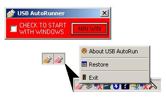



## USB AutoRunner

### Description

A fully formed application based on USB AUTORUN By: Kevin Ritch. Complete with animated systray icon, the option to place the the application in the startup folder. Application writes no data to the registry, therefore very compact.

The application looks to see if a USB Flash Drive has just been inserted and executes the AUTORUN.INF file if present.

In other words, it enables a CD Style autorun.

Useful when using a portable app launcher like "PStart", that write an autorun file, on older systems - pre XP SP2
 
### More Info
 
none known

             |
---                |---
**Submitted On**   |2006-12-17 21:54:22
**By**             |[caver dave](https://github.com/Planet-Source-Code/PSCIndex/blob/master/ByAuthor/caver-dave.md)
**Level**          |Intermediate
**User Rating**    |4.0 (8 globes from 2 users)
**Compatibility**  |VB 6\.0
**Category**       |[Complete Applications](https://github.com/Planet-Source-Code/PSCIndex/blob/master/ByCategory/complete-applications__1-27.md)
**World**          |[Visual Basic](https://github.com/Planet-Source-Code/PSCIndex/blob/master/ByWorld/visual-basic.md)
**Archive File**   |[USB\_AutoRu20383012182006\.zip](https://github.com/Planet-Source-Code/caver-dave-usb-autorunner__1-67410/archive/master.zip)

### API Declarations

See Code

